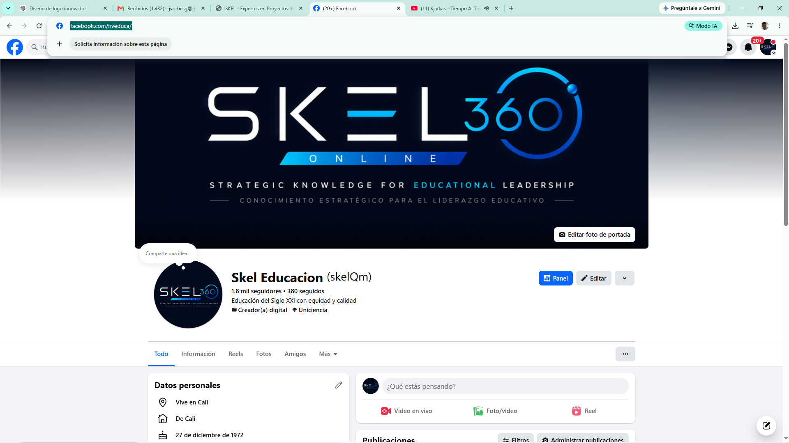

# Preparación para el Plan de Marketing y Posicionamiento - SKEL 360

Para iniciar con nuestra estrategia de posicionamiento, ventas y marketing, **NO necesito tus contraseñas** (por tu propia seguridad es mejor que las mantengas privadas). Lo que haremos será trabajar en equipo: yo diseño la estrategia, escribo los textos, genero el código necesario (como píxeles de seguimiento) y tú te encargas de publicarlos o conectarlos desde tus cuentas.

Aquí tienes la lista de lo que necesitas tener listo o ir creando para que podamos arrancar con toda la fuerza:

## 1. Redes Sociales (Canales Oficiales)
Como SKEL 360 es una plataforma B2B (Business to Business) dirigida a instituciones de educación superior, rectores y líderes de calidad, estas son las redes clave:
- [ ] **Página de LinkedIn (Empresa):** ESENCIAL. Aquí es donde están los rectores, decanos y directores de calidad.
- [ ] **Perfil personal de LinkedIn (John Orbes):** Muy importante para hacer "Social Selling" (ventas directas) como líder y experto en el tema.
- [ ] **Página de Facebook / Instagram:** Útil para generar confianza y hacer pauta publicitaria (anuncios).
- [ ] **Canal de YouTube:** Ideal para subir videos de "Cómo funciona SKEL 360" o testimonios (las demostraciones en video venden muchísimo).

## 2. Herramientas de Análisis y Rastreo (Para instalar en la web)
Yo me encargaré de instalar el código de estas herramientas en nuestra plataforma (`index.html`), pero necesito que tú abras las cuentas:
- [ ] **Google Analytics 4 (GA4):** Para saber cuántas personas visitan la página web, de qué ciudades vienen y qué miran.
- [ ] **Google Search Console:** Para que Google indexe la página oficial y aparezcamos cuando alguien busque "software acreditación educación superior Colombia".
- [ ] **Píxel de Meta (Facebook/Instagram):** Si planeamos pagar publicidad en el futuro, esto nos ayudará a rastrear quién visita la web desde un anuncio.

## 3. Herramientas de Ventas y Correos
- [ ] **Base de datos inicial (Contactos):** Un archivo Excel o lista con correos de posibles clientes (universidades, institutos técnicos) a los que queramos tocarles la puerta.
- [ ] **Plataforma de Email Marketing (Opcional):** Si vamos a enviar correos masivos (boletines), podemos usar herramientas gratuitas como Mailchimp o Brevo. (Aunque ya tenemos nuestro propio sistema de correos interno para notificaciones, para marketing masivo es mejor usar una de estas).

## 4. Insumos de Marca (Brand Kit)
- [ ] Logotipos en alta calidad (ya tenemos algunos).
- [ ] Colores y tipografías (ya los tenemos definidos en la plataforma web).
- [ ] Una propuesta de valor clara: ¿Qué dolor específico de las universidades resuelve SKEL 360 de forma más rápida y económica que la competencia? (Esto lo definiremos juntos en nuestro primer ejercicio).

---

**Siguiente paso:**
Ve revisando esta lista. Cuando estés listo, me avisas y empezamos a redactar nuestra primera **"Secuencia de Correos en Frío"** para contactar a los primeros rectores o creamos nuestra primera campaña de LinkedIn.
